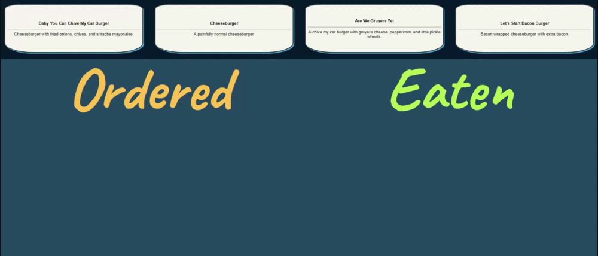

[Click here to use this application.](https://lit-crag-20718.herokuapp.com)

# About

Keep track of what burgers have been ordered, and which of those orders have been delivered or eaten. Utilizes JawsDB and MySQL.

## Usage
- [Run the application](https://lit-crag-20718.herokuapp.com)
- Choose which burger the customer has ordered
- Click 'order up' when the food is ready to be taken to the customer
- Mark the food either returned or completed, accordingly.

### **Last Updated**: 

10/22/20

## Current Features
- Custom menu creation with ingredients and substitutions
- Database to hold the menu, not just the food
- More options for what happens with the food